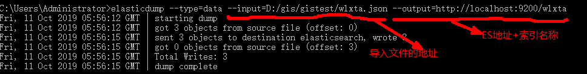
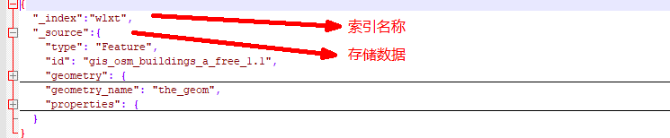
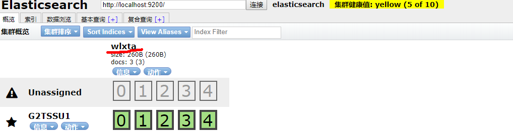
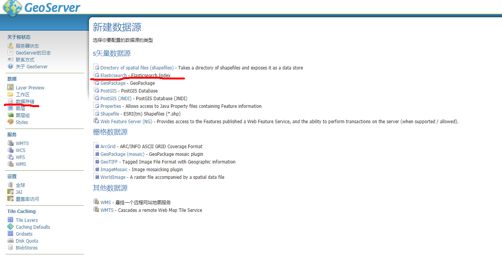
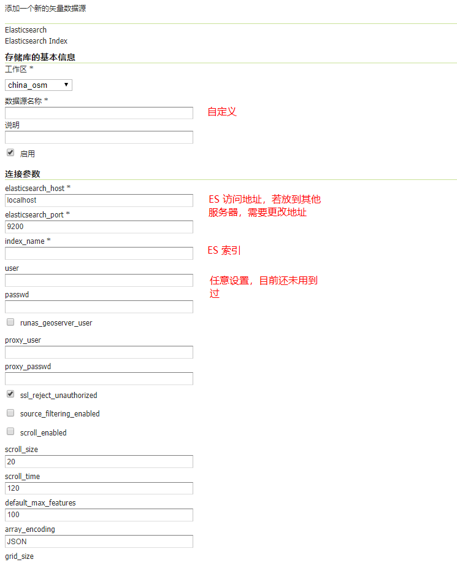
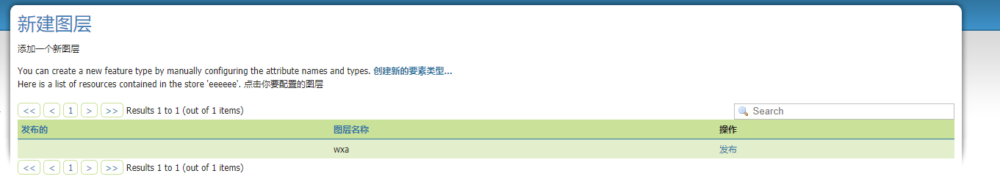
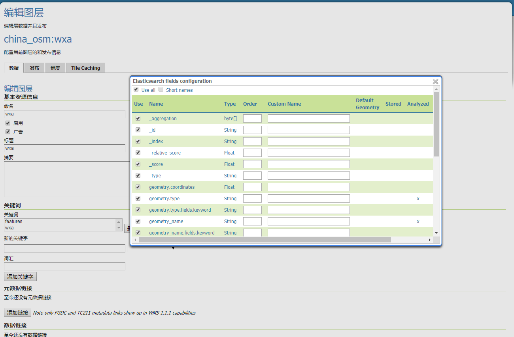
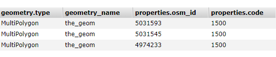
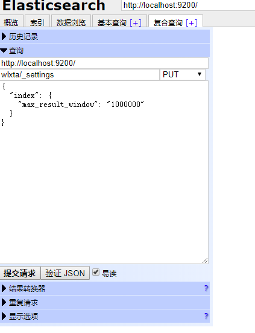

# elasticsearch-MD
FE to use elasticsearch

注：elasticsearch 以下简称为 ES。

## elasticsearch  

单独使用 ES 进行前端搜索功能。  

第一步，下载 ES (https://elasticsearch.cn/download/)。

由于 ES-5 到 ES-7 将 <code>type</code> 字段去掉了，这里没有用到 geoserver，因此在这里使用的是新版本 elasticsearch-7.3.0。

下载完成后直接解压即可，然后双击 elasticsearch-7.3.0\bin 下的 elasticsearch.bat 文件运行即可。

参考资料(https://blog.csdn.net/weixin_42633131/article/details/82902812)

第二步，下载 elasticsearch-head 插件。  

这个插件实现了 ES 的可视化，github(https://github.com/mobz/elasticsearch-head),里面有使用文档。

该插件更详细的说明文档(https://blog.csdn.net/Zereao/article/details/89378283)，该文档详细介绍了 ES-7 的内容，强烈推荐。  

第三步，导入数据。  

由于本人是前端，ES 是用 JAVA 开发的，一般都是用 JAVA 或 Python 进行数据存储，因此我又找到一个插件进行 JSON 文件的数据存储。

elasticsearch-dump github(https://github.com/taskrabbit/elasticsearch-dump)，里面有详细的使用文档，我简单写个存储样例：  



下图为新版本 ES JSON 的格式。  



查看 已经启动的 elasticsearch-head(http://localhost:9100) 即可查看并进行数据查询。  

  

第四步，前台搜索操作。  

前台我找到了一个依赖 elasticsearch-js(https://github.com/elastic/elasticsearch-js)。  

下面我贴一个简单的 demo。  

```javascript
const { Client } = require('@elastic/elasticsearch');
const client = new Client({ node: 'http://localhost:9200' })
client.search({
  index: 'wlxt',
  type: '_doc',
  body: {
    "query": {
      "bool": {
        "must": [
          {
            "match": {
              "properties.name": "华"
            }
          }
        ],
        "must_not": [ ],
        "should": [ ]
      }
    }
  }
},(err, result)=>{
  if(err){
    console.log(err)
  }
  if(result){
    console.log(result)
  }
})
```  

注：在我写这个 demo 的时候，大家注意那个 <code>type</code> 字段还需要加上，在之前导入数据时 elasticsearch-head 会自动加上 <code>type='_doc'</code>，因此这里也需要加上，否则会报错。  

body 字段里的查询语句可以参考 elasticsearch-head 里的语句进行相应修改。    

## elasticsearch geoserver  

第一步，下载安装 geoserver,版本 2.14.2(http://geoserver.org)。  

第二步，下载安装 ES，同上面的下载方法，只是由于 geoserver-2.14.2 版本需要 type 字段，需要下载 ES 版本为5。  

第三步，下载安装 elasticsearch-head，同上面方法。  

第四步，导入数据。  

第五步，下载 ElasticGeo(https://github.com/ngageoint/elasticgeo/releases),列表里有相对应的 geoserver 版本，进行相应下载即可。  

下载 zip 后并解压，将 elasticgeo-*.jar 拷贝到 GeoServer_HOME/webapps/geoserver/WEB-INF/lib 目录下即可。  

重启 geoserver，进入可视化页面后，在数据存储-新建数据存储中即可找到，如下图。  

  

点击 ElasticSearch 后的基本操作我用如下图片进行简单介绍。  

  

输入完成后直接点击保存，将出现下面的页面。  

  

与其他 geoserver 发布数据一样，点击发布。  

  

说明：由于 ES 存储方式为非关系类型，它会出现如下的存储属性，这种方式通过 geoserver 的 cql_filter 无法获取到。

  

因此，在弹出的对话框中，你需要根据实际需求将字段名称进行修改(在 Custom Name字段中输入即可)，修改完成后点击底部应用即可。  

编辑图层页面应该没什么好说的，和普通编辑图层一样。  

保存后即可在图层或者 Layer Preview 中进行查看。  

第六步，前台搜索操作。  

这里直接用 ajax 即可进行数据的搜索。  

```javascript
var searchContent = '%' + '国' + '%';
var str = '&cql_filter=name+like+'+ '%27' + encodeURI(searchContent) + '%27';
var urlw = 'http://localhost:8089/geoserver/*/ows?service=WFS&version=1.0.0&request=GetFeature&typeName=*:wxa&outputFormat=application/json';
$.ajax({
  url: urlw + str,
  success: function(result){
    console.log(result);
  },
  error: function(error){
    console.log(error);
  }
})
```  

代码里的 url 即在 geoserver Layer Preview 里相应图层获取 WFS-GeoJson 下数据的 url。这里需要注意的就是搜索语句中文需要进行转码。  

sql 查询方法除了 like 还有别的，更多的话就去官网或者搜索吧。   

在进行搜索时可能会遇到 <code color="red">Result window is to large</code> 的错误。通过加入下图中代码可解决。  

  

最后贴一个修改 geoserver 跨域的链接：  

GeoServer-2.13.* (https://jianshu.com/p/68a84833e21c)  

GeoServer-2.15.0 (https://segmentfault.com/a/1190000020522558?utm_source=tag-newest)

总结：  
1. 版本匹配很重要  

2. geoserver-2.16.* 版本我还没有试，不知道那个 type 属性是否还需要  

写在最后：笔者把整个 ES 的学习过程总结并分享，如果有问题可以联系我进行讨论，谢谢！

